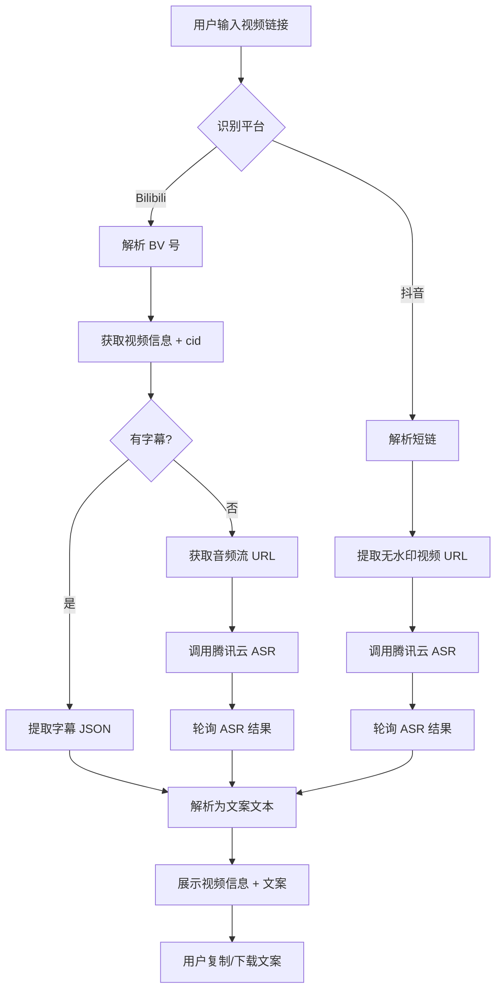

## 1. 产品概述

视频文案提取器——一个输入 Bilibili/抖音视频链接即可提取视频文案的在线工具。核心解决「视频内容转文字」的需求，面向内容创作者、研究者、以及需要快速获取视频文字内容的普通用户。产品以纯 Web 形式部署，用户无需安装任何软件，打开链接即可使用，方便分享给朋友。

- **核心价值**: 将视频中的语音/字幕内容一键转为可复制、可编辑的文字
- **目标用户**: 自媒体创作者、视频内容研究者、字幕组、需要快速浏览视频内容的用户
- **部署方式**: 腾讯云 EdgeOne Pages（静态前端 + Edge Functions 后端）

## 2. 核心功能

### 2.1 用户角色

本产品无角色区分，所有访问者均为普通用户，无需注册登录。

### 2.2 功能模块

1. **首页（核心页面）**: 链接输入区、平台识别、提取结果展示、文案操作区
2. **历史记录页**: 本地存储的提取历史，支持快速回看和重新复制

### 2.3 页面详情

| 页面名称 | 模块名称 | 功能描述 |
|---------|---------|---------|
| 首页 | Hero 输入区 | 大型输入框，支持粘贴 B站/抖音链接，自动识别平台，显示平台图标和链接预览 |
| 首页 | 提取状态区 | 实时显示提取进度（解析链接→获取字幕/音频→语音识别→完成），带动画反馈 |
| 首页 | 视频信息卡 | 显示视频标题、封面缩略图、UP主/作者、时长等元数据 |
| 首页 | 文案结果区 | 提取的完整文案，支持时间戳显示（如有）、一键复制、下载为 TXT |
| 首页 | 操作工具栏 | 复制全文、下载 TXT、清空、重新提取 |
| 历史记录 | 历史列表 | 按时间倒序展示最近 20 条提取记录，存储于 localStorage |
| 历史记录 | 记录操作 | 点击查看详情、删除单条、清空全部 |

## 3. 核心流程

### 3.1 B站视频文案提取流程

1. 用户粘贴 B站视频链接（支持 BV1xxxx、b23.tv 短链、完整 URL）
2. 系统自动识别为 B站链接，解析出 BV 号
3. 后端调用 B站 API 获取视频信息（标题、封面、UP主、cid）
4. 后端调用 B站播放器 API 检查是否有字幕轨道
5. **有字幕**: 直接获取字幕 JSON，解析为带时间戳的文本
6. **无字幕**: 获取音频流 URL → 调用腾讯云 ASR 录音文件识别 → 轮询获取结果
7. 前端展示视频信息 + 文案结果

### 3.2 抖音视频文案提取流程

1. 用户粘贴抖音视频链接（支持 v.douyin.com 短链、完整分享文本）
2. 系统自动识别为抖音链接
3. 后端解析短链获取视频页面，提取无水印视频 URL
4. 后端将视频 URL 传给腾讯云 ASR 录音文件识别
5. 轮询 ASR 任务结果（通常 10-60 秒）
6. 前端展示视频信息 + 文案结果

### 3.3 流程图

## 4. 用户界面设计

### 4.1 设计风格

**设计方向**: 暗色媒体工作室风格——深色背景配合霓虹渐变高光，营造出专业视频工具的氛围。整体偏「暗黑科技感」，但在交互细节上保持柔和与精致。

- **主色调**: 深黑背景 (#0a0a0f) + 紫粉渐变主色 (#a855f7 → #ec4899) + 青色辅助色 (#06b6d4)
- **按钮风格**: 渐变填充按钮，圆角 12px，hover 时有光晕效果
- **字体**: 标题使用 Bricolage Grotesque（独特、现代），正文使用 DM Sans（清晰、可读）
- **布局风格**: 单列居中布局，卡片式内容区，顶部固定导航栏
- **图标风格**: Lucide Icons 线条图标，配合平台品牌色
- **动效**: 输入框聚焦时的渐变边框动画、提取过程中的脉冲加载动画、结果出现时的渐入效果

### 4.2 页面设计概览

| 页面名称 | 模块名称 | UI 元素 |
|---------|---------|---------|
| 首页 | 顶部导航 | 左侧 Logo + 产品名，右侧 GitHub 链接和历史记录入口 |
| 首页 | Hero 输入区 | 大标题 + 副标题，大型输入框带平台自动识别图标，渐变提取按钮 |
| 首页 | 提取状态 | 步骤指示器（4步），当前步骤高亮脉冲动画，进度条 |
| 首页 | 视频信息卡 | 玻璃态卡片，左侧封面图，右侧标题/作者/时长，平台标签 |
| 首页 | 文案结果 | 等宽字体文案展示区，时间戳灰色小字，右上角操作按钮组 |
| 首页 | 错误提示 | 红色边框 Toast 提示，带错误说明和重试按钮 |
| 历史记录 | 历史列表 | 卡片列表，每条显示视频标题、平台、提取时间、文案预览 |

### 4.3 响应式

- 桌面优先设计，最大宽度 960px 居中
- 移动端自适应：输入框全宽、卡片单列、字号适当缩小
- 触摸优化：按钮最小点击区域 44px，输入框足够大方便粘贴

### 4.4 3D 场景

不适用（本产品为工具型 Web 应用，无 3D 场景需求）。
