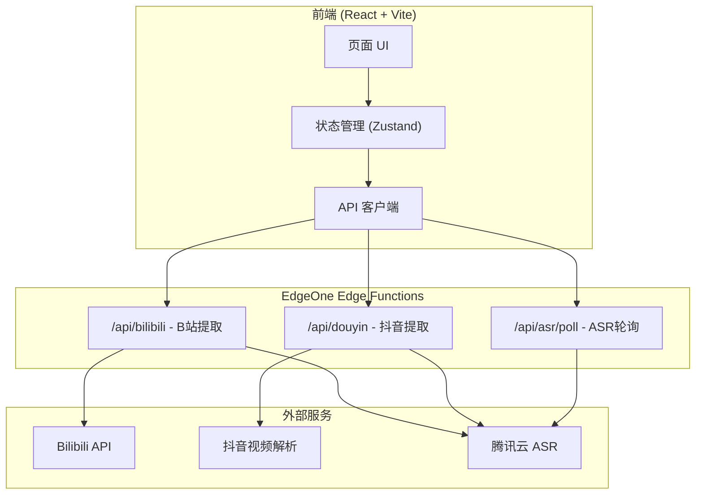
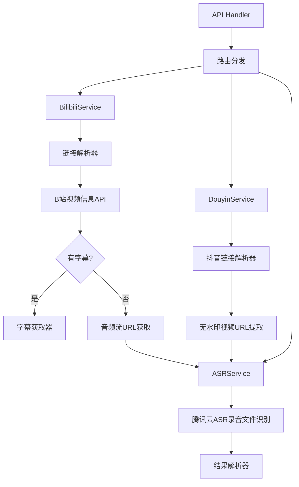

## 1. 架构设计



## 2. 技术说明

- **前端**: React@18 + TypeScript + Tailwind CSS@3 + Vite
- **状态管理**: Zustand
- **路由**: React Router DOM
- **图标**: Lucide React
- **后端**: 腾讯云 EdgeOne Edge Functions（基于 Web Standards Fetch API）
- **开发环境后端**: Express.js（本地开发用，生产部署使用 Edge Functions）
- **语音识别**: 腾讯云 ASR 录音文件识别 API
- **初始化工具**: vite-init (react-express-ts 模板)
- **包管理器**: npm

### 2.1 运行时兼容性策略

EdgeOne Edge Functions 基于 Web Standards（Fetch API、Request/Response），与 Node.js 环境有差异。为保证代码可同时在本地开发（Express）和生产环境（Edge Functions）运行：

- **核心逻辑层**: 纯函数，仅使用 fetch API，不依赖 Node.js 专有模块
- **Express 适配层**: 本地开发时，用 Express 路由包装核心逻辑
- **Edge Function 适配层**: 生产部署时，用 EdgeOne 的 fetch handler 包装核心逻辑

## 3. 路由定义

| 路由 | 用途 |
|------|------|
| / | 首页 - 链接输入 + 提取结果展示 |
| /history | 历史记录页 - 本地存储的提取历史 |

## 4. API 定义

### 4.1 B站文案提取

```typescript
// POST /api/bilibili
interface BilibiliRequest {
  url: string; // B站视频链接（BV号、短链、完整URL）
}

interface BilibiliResponse {
  success: boolean;
  data?: {
    title: string;
    cover: string;       // 封面图URL
    author: string;      // UP主名称
    duration: number;    // 视频时长（秒）
    bvid: string;
    subtitleSource: 'subtitle' | 'asr'; // 文案来源
    transcript: TranscriptSegment[];
  };
  error?: string;
  taskId?: string;       // ASR任务ID（需要轮询时返回）
}

interface TranscriptSegment {
  start: number;   // 开始时间（秒）
  end: number;     // 结束时间（秒）
  text: string;    // 文本内容
}
```

### 4.2 抖音文案提取

```typescript
// POST /api/douyin
interface DouyinRequest {
  url: string; // 抖音视频链接（短链、分享文本）
}

interface DouyinResponse {
  success: boolean;
  data?: {
    title: string;
    cover: string;
    author: string;
    duration: number;
    transcript: TranscriptSegment[];
  };
  error?: string;
  taskId?: string; // ASR任务ID
}
```

### 4.3 ASR 结果轮询

```typescript
// GET /api/asr/poll?taskId=xxx
interface ASRPollResponse {
  success: boolean;
  status: 'processing' | 'success' | 'failed';
  transcript?: TranscriptSegment[];
  error?: string;
}
```

## 5. 后端架构图



## 6. 数据模型

### 6.1 本地存储模型（localStorage）

本产品不使用数据库，历史记录存储在浏览器 localStorage 中。

```typescript
// 历史记录项
interface HistoryItem {
  id: string;              // 唯一ID（时间戳 + 随机数）
  platform: 'bilibili' | 'douyin';
  url: string;             // 原始链接
  title: string;           // 视频标题
  cover: string;           // 封面URL
  author: string;          // 作者
  transcriptText: string;  // 纯文本文案（用于预览）
  transcriptSegments: TranscriptSegment[]; // 带时间戳的文案
  createdAt: number;       // 提取时间戳
}
```

### 6.2 环境变量

```
# 腾讯云 ASR 配置（在 EdgeOne 环境变量中设置）
TENCENT_SECRET_ID=xxx
TENCENT_SECRET_KEY=xxx
TENCENT_APP_ID=xxx
```

## 7. 部署说明

### 7.1 本地开发

```bash
npm install
npm run dev        # 启动前端 + Express 后端
```

### 7.2 EdgeOne 部署

1. 构建前端: `npm run build`（输出到 `dist/`）
2. Edge Functions 部署: 将 `edge-functions/` 目录下的函数部署到 EdgeOne
3. 环境变量: 在 EdgeOne 控制台设置腾讯云 ASR 密钥
4. 路由配置: `/api/*` 路由到 Edge Functions，其余路由到静态文件

### 7.3 GitHub 仓库结构

```
/
├── src/                    # React 前端源码
├── api/                    # Express 本地开发后端
├── edge-functions/         # EdgeOne Edge Functions（生产部署）
├── shared/                 # 前后端共享类型定义
├── dist/                   # 构建输出（gitignore）
├── .trae/documents/        # 项目文档
├── package.json
├── vite.config.ts
├── tailwind.config.js
└── tsconfig.json
```
